[TOC]

# css 文本内容
- `<input type="text" placeholder="手机号">`
- ``
# 网页布局
## 总布局
  aside侧边
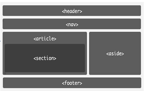
## 目录
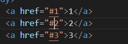
attention:
    如果页面的内容过少或没有到达单页上限，则不适合使用“目录”
  `<a href="#1">1</a>`

## table表格
- `tr`行&emsp; `td`单元格&emsp;`th`定义单元格
- `<th>`单元格自带字体加粗和居中效果
- `border-collapse: collapse`合并边框
- `colspan="num"`合并列     `rowspan="num"`合并行 (在td和th中使用)
- `caption`表标题，在css内附加词间距时需要空格
  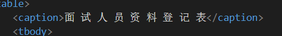

# css 概念
- 标签关系：包含关系，父子关系
- 网页布局三大核心：盒子模型、浮动、定位
- `border`边框 `content`内容 `padding`内边距 `margin`外边距
  meta媒体标题，
  charset字符集，
  UTF-8中文字符，
  lang语言
  
  `display: flex`：弹性布局，放在父级内，里面的子级会更有效地进行排序、对齐和分配空白空间。（相比于`relative`和`absolute`）
  
## div样式：
- `border-radius:5px;` 全圆角（也可以分别设置四个方向）
- `border-bottom-right-radius:5px;` 右下圆角（写时先写上下再写左右）
- `overflow:hidden;`div中超出边框的部分隐藏
- `text-align；`文本对齐（默认left左对齐，center居中，right右对齐）
- `word-spacing:30px;`词间距，词之间保留空格
- `writing-mode:vertical-lr`【竖直方向从左向右】/`vertical-rl`【竖直方向从右向左】;文字排列，
- `text-decoration:underline line-through`(一个文本多个描述可以直接写，中间不需要加逗号)
- img:只设置一个边，另一边会等比例缩放。

- 标签转换
## 定位
#### 定位的组成：
-定位：将盒子定在某个位置，所以定位也是摆放盒子，按照定位的方式移动盒子
- 定位=定位模式+边偏移
- 定位模式：用于指定一个元素在文档中的存在方式
- 定位模式它是通过css的position属性来设置的，值可以分为五个：static静态定位，relative相对定位，absolute绝对定位，fixed固定定位，sticky粘性定位

- 边偏移：就是定位的盒子移动到最终位置，有top、bottom、left、right四个属性

- 静态定位（了解）：是元素默认的定位方式，简单理解无定位的意思，静态定位按照标准流特性摆放位置，它没有边偏移
- 相对定位（`relative`）：
  1.相对于自己原来的位置来移动（`移动位置时参照点是自己原来的位置`）
  2.原来在标准流的位置继续占有，后面的盒子仍然以标准流的方式对待它(`不脱离文档流，继续保持原来的位置`)
- 绝对定位（absolute）
  如果没有祖先元素或者祖先元素没有定位，则以浏览器为准定位
  如果父元素有定位（`相对、绝对、固定定位`），则以最近一级的有定位的祖先元素为参考点移动位置
  不占有原来的位置（`脱离文档流，不保留原来的位置`）
- 相对定位和绝对定位有什么使用场景
  子绝父相：`自己使用绝对定位，父级则需要使用相对定位`
- 子绝：`子级用绝对定位，不会占用位置，可以放到父盒子里面的任何一个地方，不会影响盒子里面的其他兄弟`
- 父相：`父盒子布局时，需要占用位置，因此父级只能是相对定位。`
- 总结：`因为父级需要占有位置，因此是相对定位，子盒子不需要占有位置，则是绝对定位。子绝父相不是永远不变的，也可以是子绝父绝、子绝父固、子绝父粘`
  
- 固定定位（`fixed`）：
  可以在浏览器页面滚动时元素的位置不会改变
- 特点：
  1、以浏览器的可视窗口为参照点移动元素，跟父元素没有任何关系，不随滚动条滚动
  2、固定定位不占有原先位置（脱离文档流）

- 粘性定位（`sticky`）：
  1、以浏览器的可视窗口为参照点移动元素（固定定位的特点），
  2、占有原先的位置，不脱离文档流（相对定位的特点）
  3、必须添加top、left、right、bottom其中一个才有效果

## 标签
- 块标签：
  独占一行，上下排布，可以直接设置宽高
- 行标签：
  不独占一行，左右排布，不能直接设置宽高

  ``显示一段文字信息（没有特殊情况一般都用span标签）
  `<a>`超链接   `target="_blank"`新页面打开
  `<base href="">`配置应用于整个html的所有a标签，如果a标签已经有超文本引用`href`的话，`base`标签不会覆盖已有引用。

- 行内块：
  默认水平排布，可以直接设置宽高
- p标签：
  p标签是一个段落标签
- 语义化标签：
  如`<header>` `<main>` `<footer>`
- 导航标签
  `<nav>`
- 其他标签
  ``上标（加在文本内即可）
  ``下标（加在文本内即可）
  `&nbsp;：小空格`   `&emsp; ,&#x3000：大空格`
  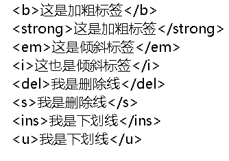
  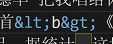`表示大于号小于号`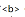

### 列表
- ul：无序列表
- ol：有序列表
- dl：自定义列表
- `<dt>`:名词或术语
- `<dd>`：对名词或术语的解释
  <dl> 
      <dt>
      <dd></dd>
      <dd></dd>
      </dt>
   </dl>

### 盒子阴影`box-border`
  水平阴影，垂直阴影，模糊的距离，以及阴影的颜色：
  `text-shadow: 5px 5px 5px #FF0000;`

### 伪类、伪元素

  `a:link {color:#FF0000;} /* 未访问的链接 */`
  `a:visited {color:#00FF00;} /* 已访问的链接 */`
  `a:hover {color:#FF00FF;} /* 鼠标划过链接 */`
  ` a:active {color:#0000FF;} /* 已选中的链接 */`

### form表单标签

- 作用：
  收集用户信息，提交给服务器。`<form action="#" >`;
  `action`为服务器地址
- label提示：
  `label`标签的for属性值和`input`标签的id值一致时，点击`label`输入框可以获取焦点
  在`input:radio`中的`name`一致时，只能有一个选项可以被选中，按钮之间互斥，也就是单选
- `input`：单行输入框
  默认text文本，placeholder提示语，password密码，`checkbox`（多选）里添加`checked`为默认选中状态
- `textarea`：多行输入框
  css样式中加入resize:none，可以取消重置文本域内容区，即不可拉伸
  row为可以输入的行数（宽），col为可以输入的列数（长）
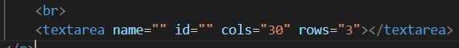

### 下拉菜单

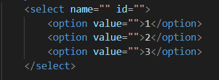

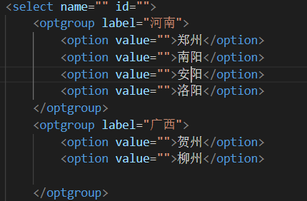

  

# 附录（截图）

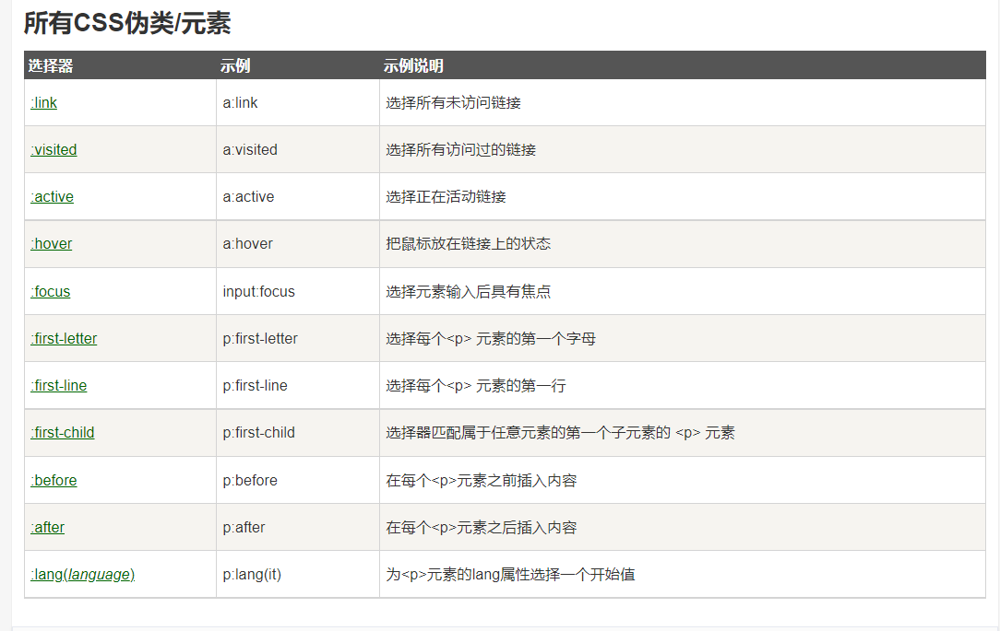
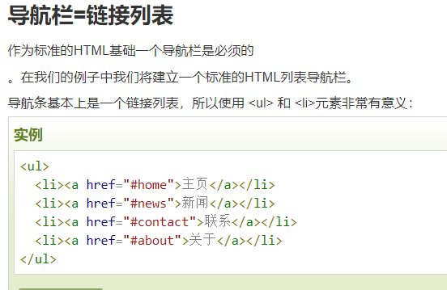
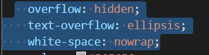
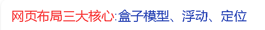
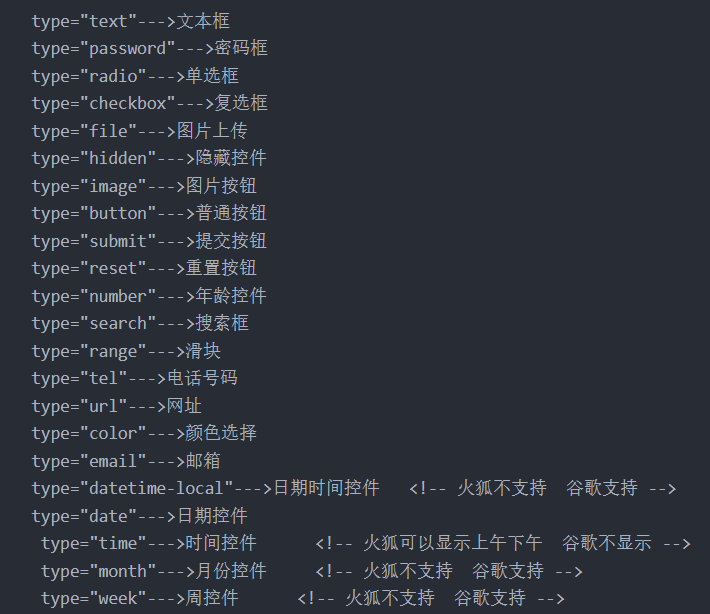

# 未分类
- 1、
如果你想控制内联元素的尺寸，你需要为元素设置display: block; （或者，display: inline-block; inline-block 混合了 inline 和 block 的特性。)
- 2、
设置一个元素为 flex 项目，那么他同样成为一个 flex 容器，它的孩子 (直接子节点) 也表现为 flexible box。