# 第三天
[TOC]

## 循环-for

### for循环-基本使用
- for循环语法：【循环还有一个叫法：`遍历`】
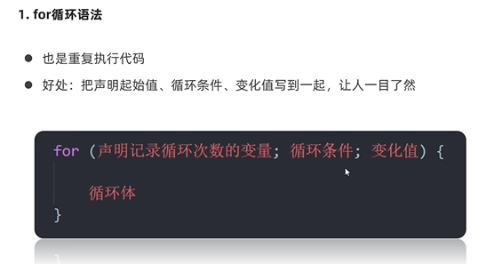
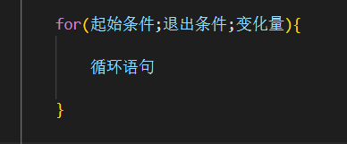
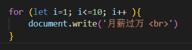
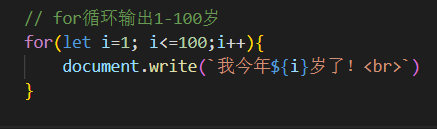
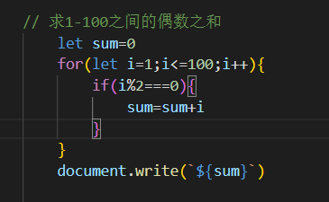
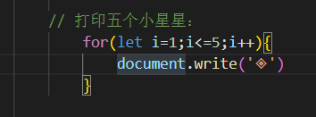
- 循环的最大价值就是`遍历数组`

- for循环和while循环的区别
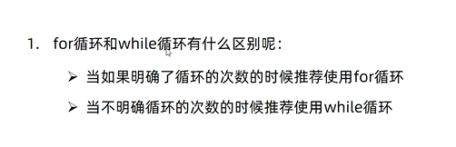

### 退出循环

- continue 和 break
  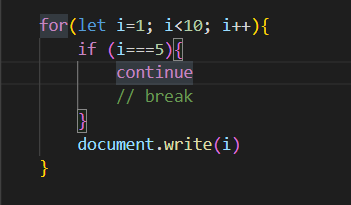

### 循环嵌套

- 外面的循环执行一次，里面的循环执行全部
- for循环代码
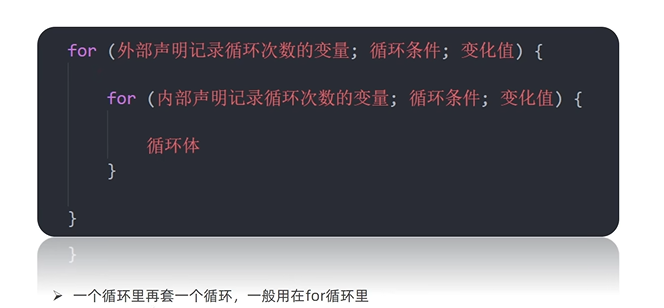
- 示例1：
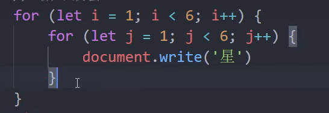
- 示例2：

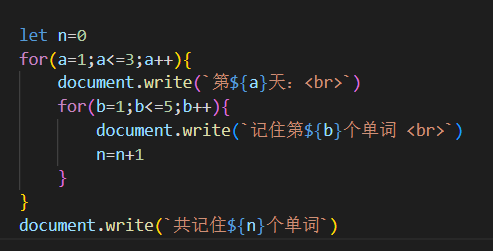
- 示例3：
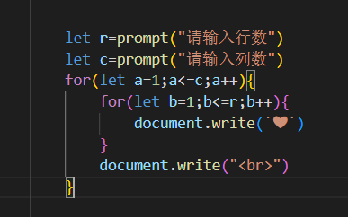
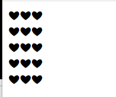
- 示例4：
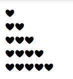
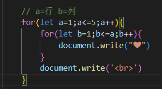
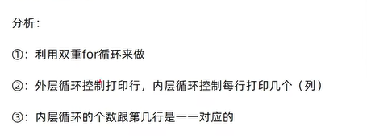
- 示例5：九九乘法表
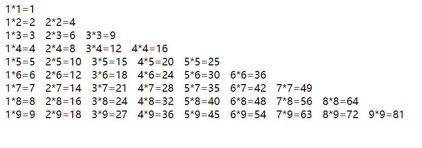
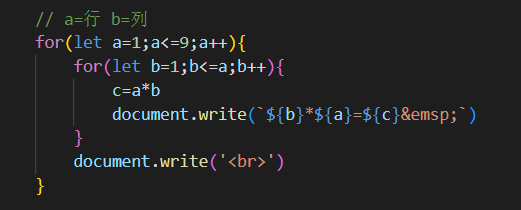

## 数组

### 数组是什么
- 数组是一种可以按顺序保存数据的`数据类型`

### 数组的基本使用
- 声明语法：
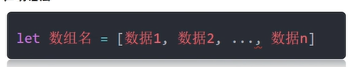
例：
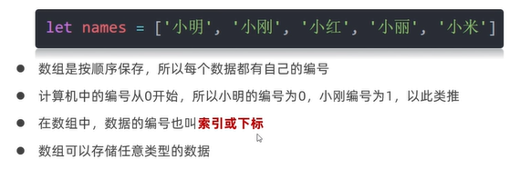
- 取值语法：
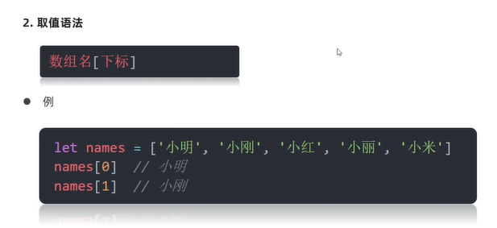
- 一些术语
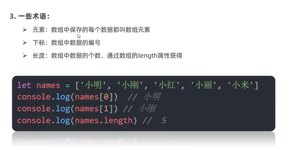
- 遍历数组
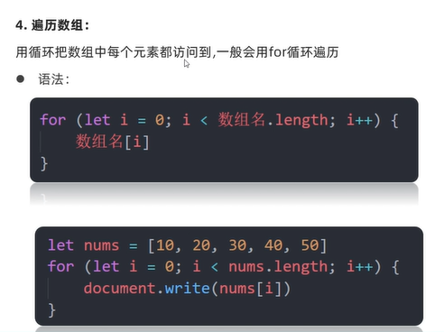
- 案例1：

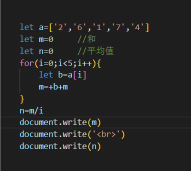
  只求和：
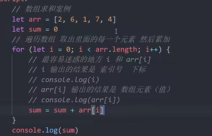
- 案例2：

### 操作数组
#### 增，删，改，查
- 数组本质是数据集合，操作数据无非就是增删改查语法
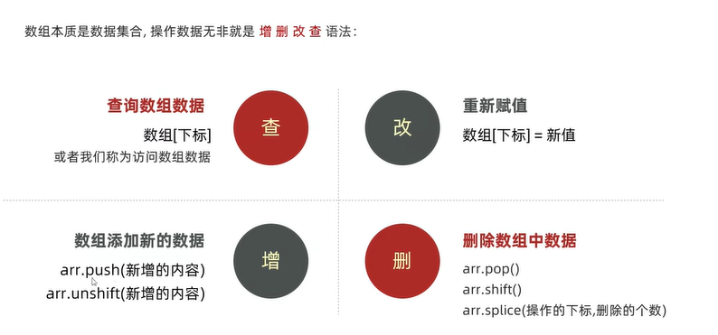

#### 改，查
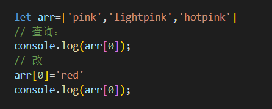

#### 增【重点】
- push：新增的数据加到数组后面
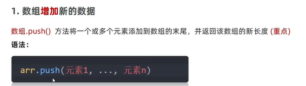
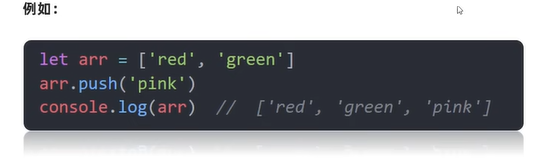

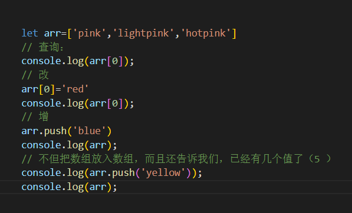

- unshift：新增的数据加到数组前面
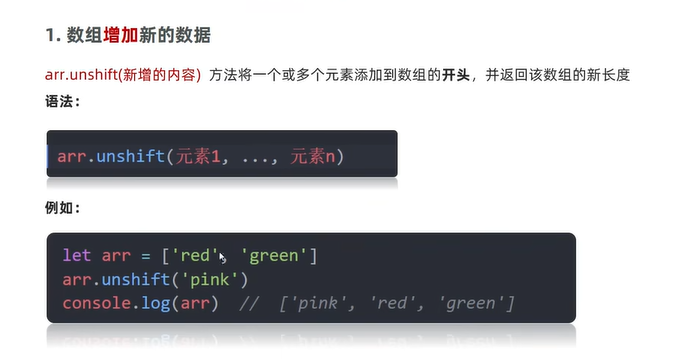

- 总结
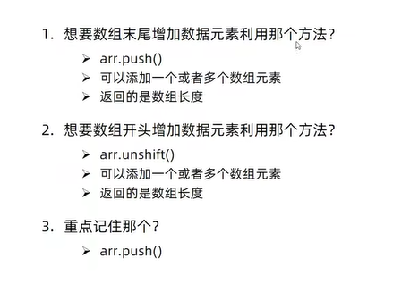

- 例子1：
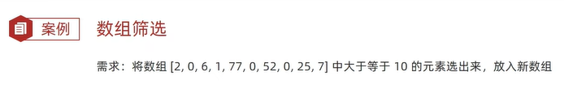
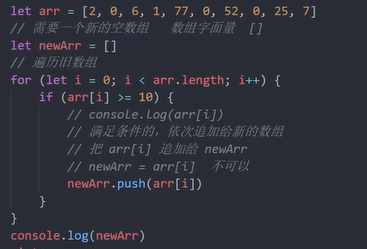
- 例子2：
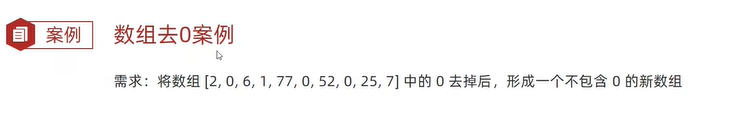
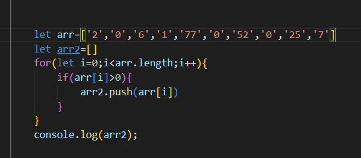

#### 删
- `pop()`:删除最后一个元素
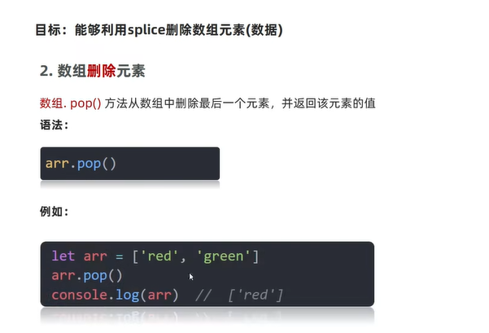
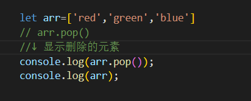
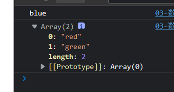

- `shift()`：删除第一个元素
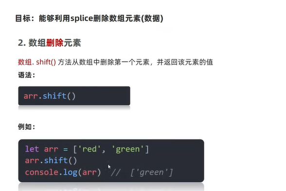
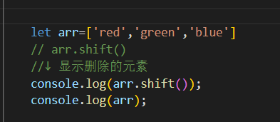
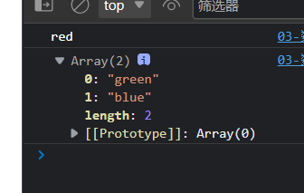

- `splice()`【重点】
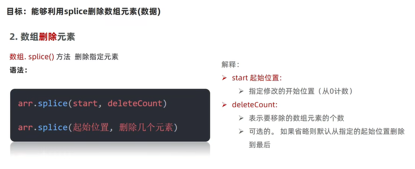
例子：
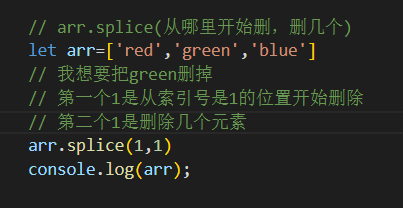
结果：
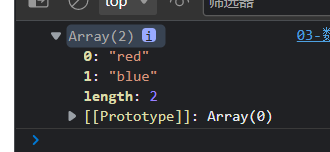
- 使用场景
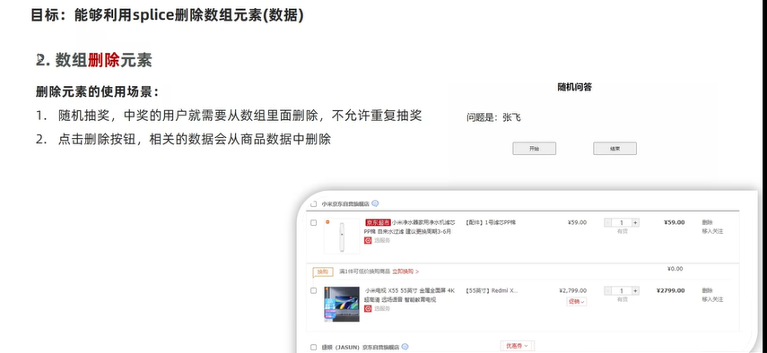
- 总结：
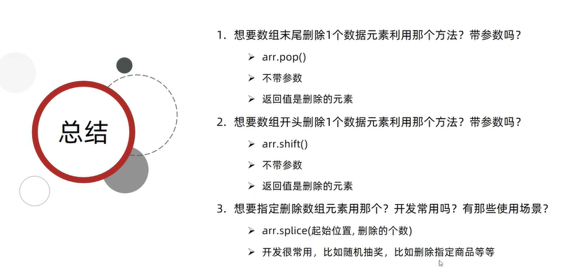

#### 冒泡排序
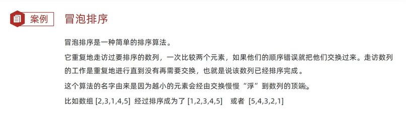
- 例子：将元素从小到大排序
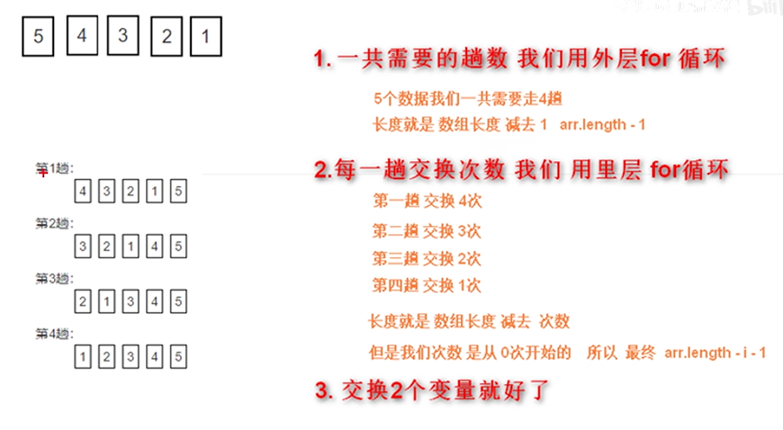
代码：
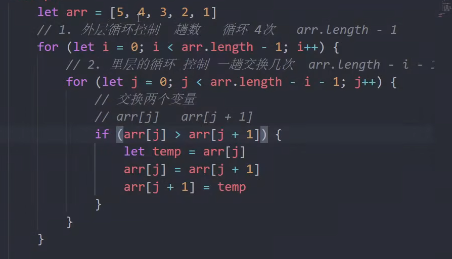
结果：

### 数组案例

## 综合案例

# 函数
## 什么是函数
  函数是被设计成为执行特定任务的代码块
## 为什么需要函数
- `function`：

## 函数使用

建议：

### 调用

### 函数体

### 封装

### 总结

## 函数传参

### 声明和调用
#### 声明

#### 调用

- 求出start-end的累加和：

### 形参和实参

### 总结

### 案例
- 函数封装求和

## 函数返回值

### return返回

- 总结

### 例子

- 求数组的最大值和最小值

- 求输入两个数的最大值

## 作用域

### 概述

- 全局作用域
  整个`<script>`和一个.js文件
- 局部作用域
  函数function
- 块级作用域

### 变量的作用域

#### 特殊情况
- 第一种

- 第二种

代码：

结果：

### 小结

### 变量访问原则-作用域链

作用链域：采用就近原则的方式来查找变量最终的值
- 案例：

### 小结

## 匿名函数

### 使用

### 立即执行函数

两种

## 综合案例

