第二天
[TOC]


# 事件

## 事件和事件监听
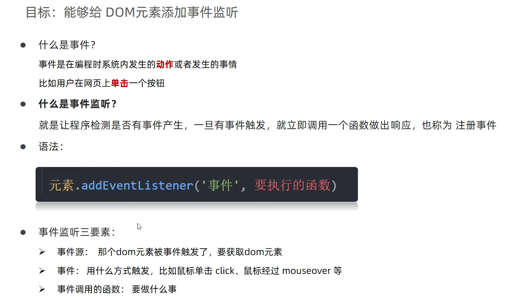
`事件监听三要素：事件源，事件，事件调用的函数`
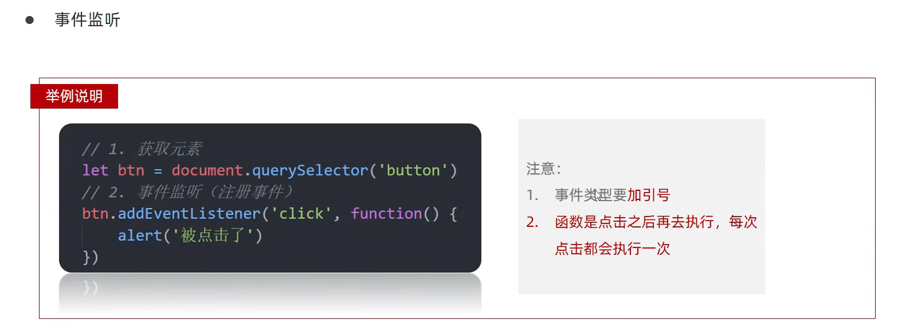
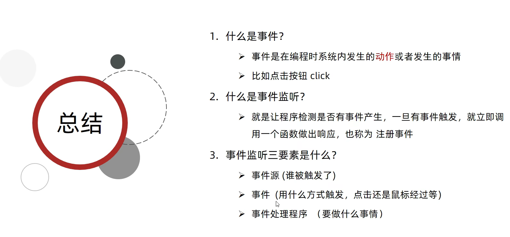
`事件源.addEventListener('事件',事件处理函数)`
### 事件监听版本
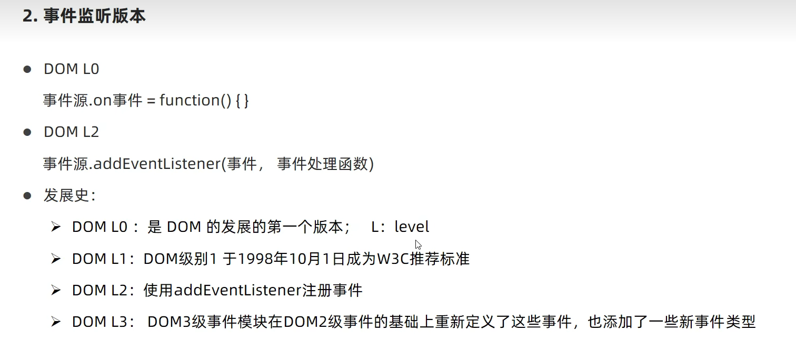

## 案例
### 1、关闭二维码
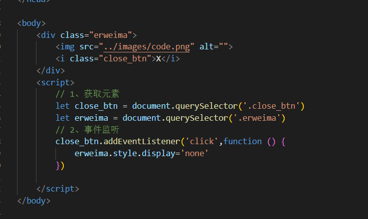
### 2、随机点名简单版
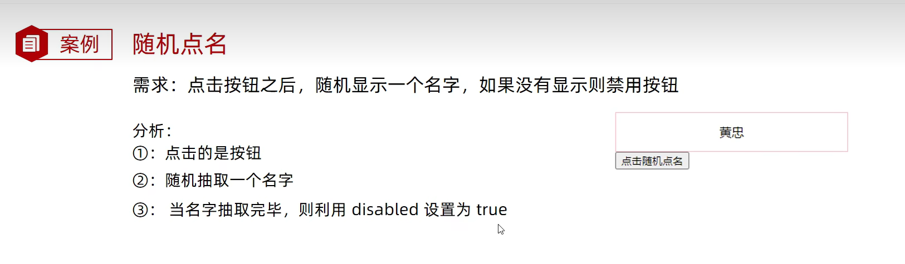
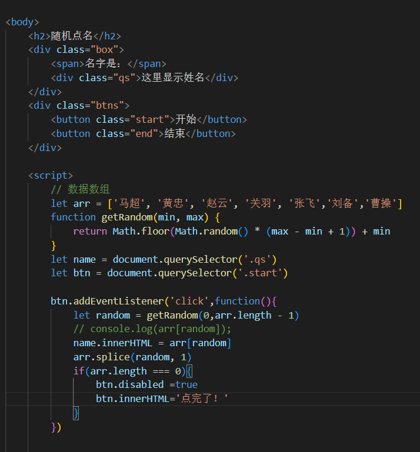
### 3、随机点名，可以开始和结束
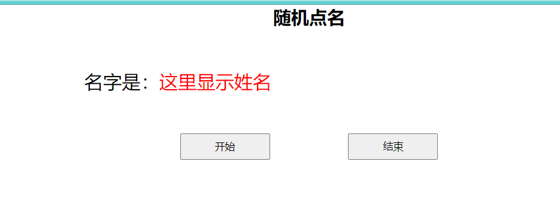
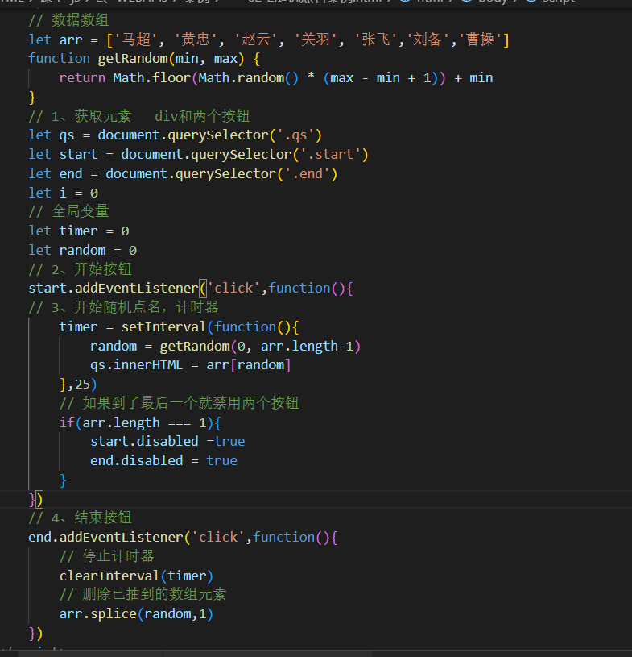
### 4、小米搜索框
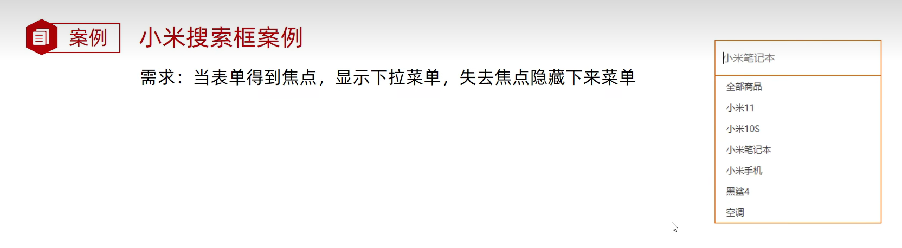
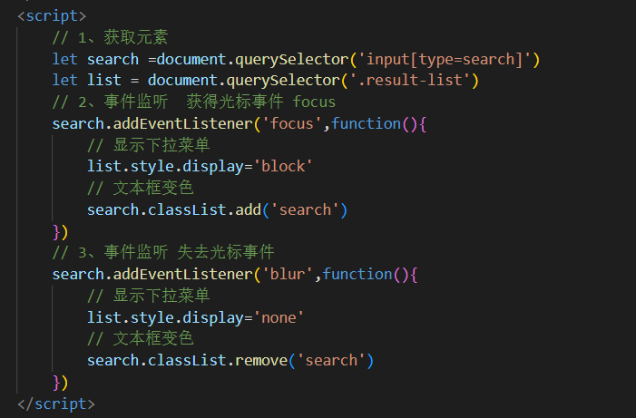
### 5、微博输入
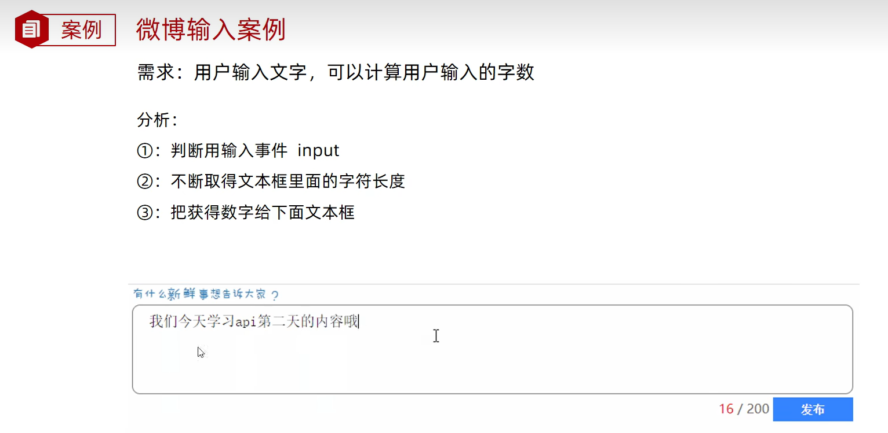
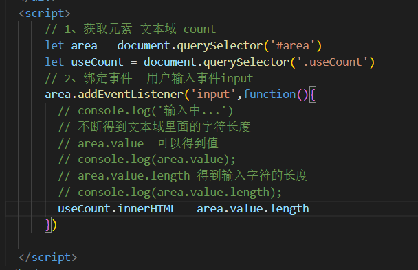
### 6、全选文本框案例1
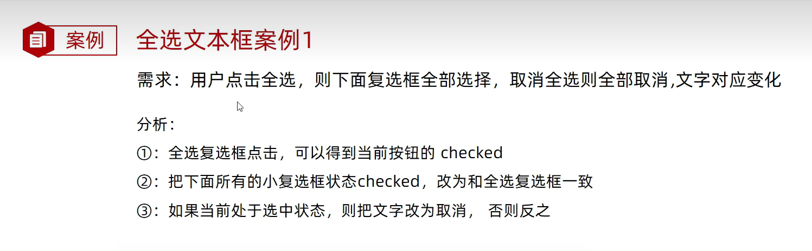
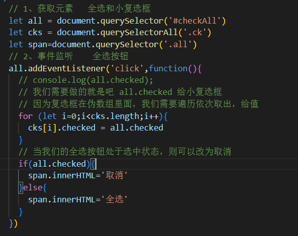
### 7、全选文本框案例2
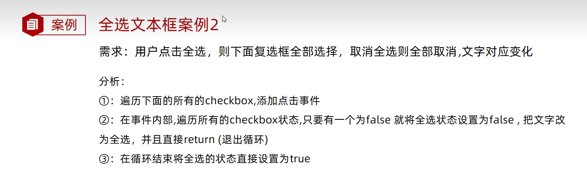
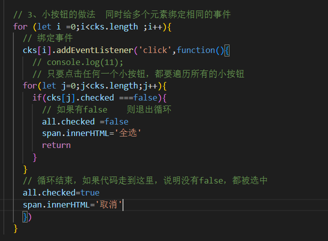
### 8、购物车加减操作
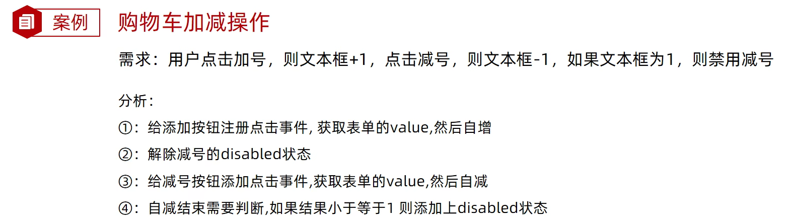

### 9、Tab栏切换

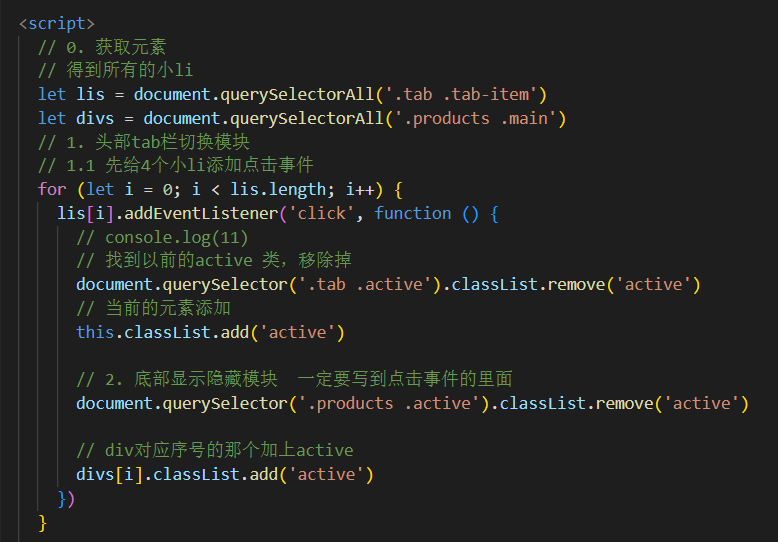

## 事件类型 
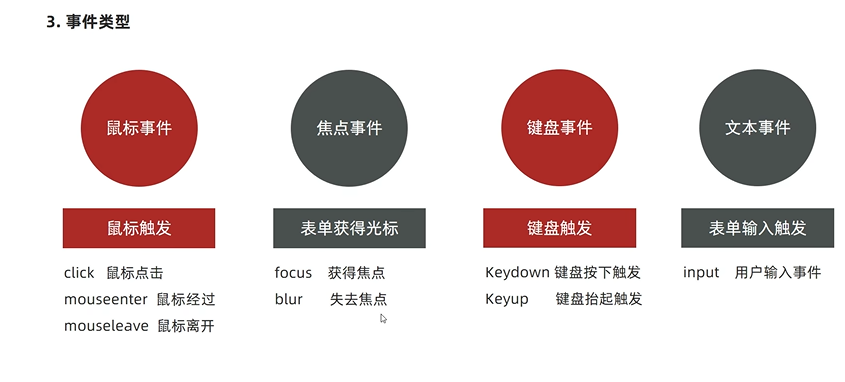

# 高阶函数
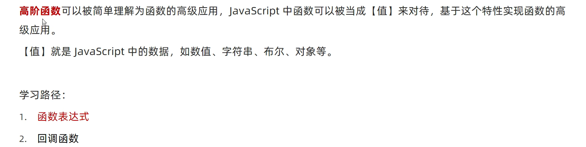
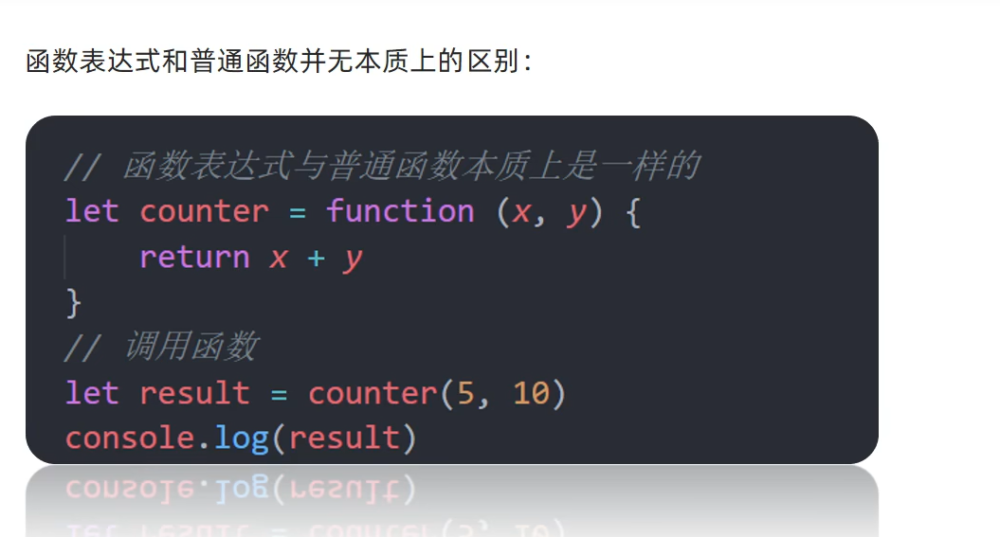
## 回调函数
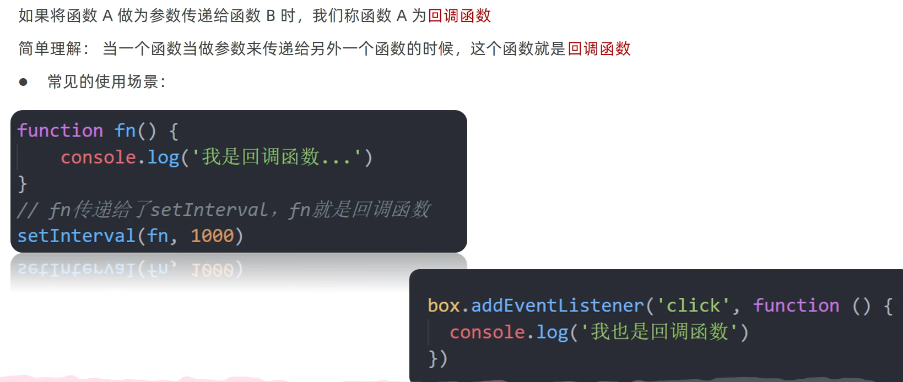
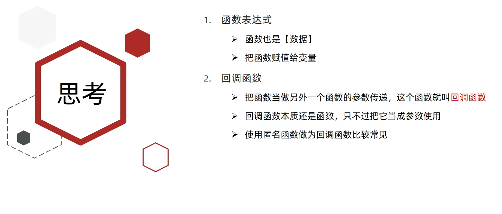
# 环境对象
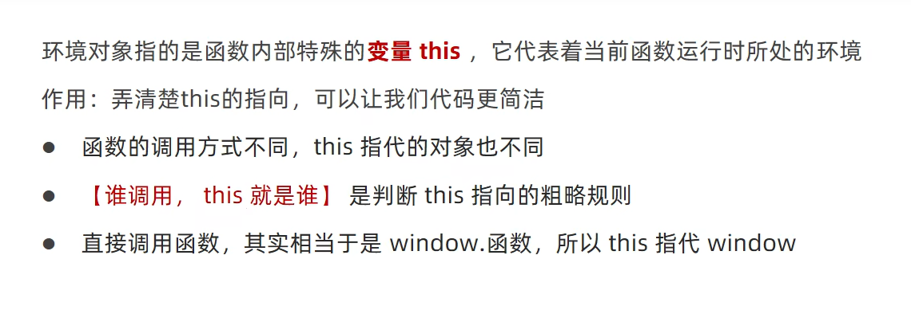

# 编程思想  排他思想
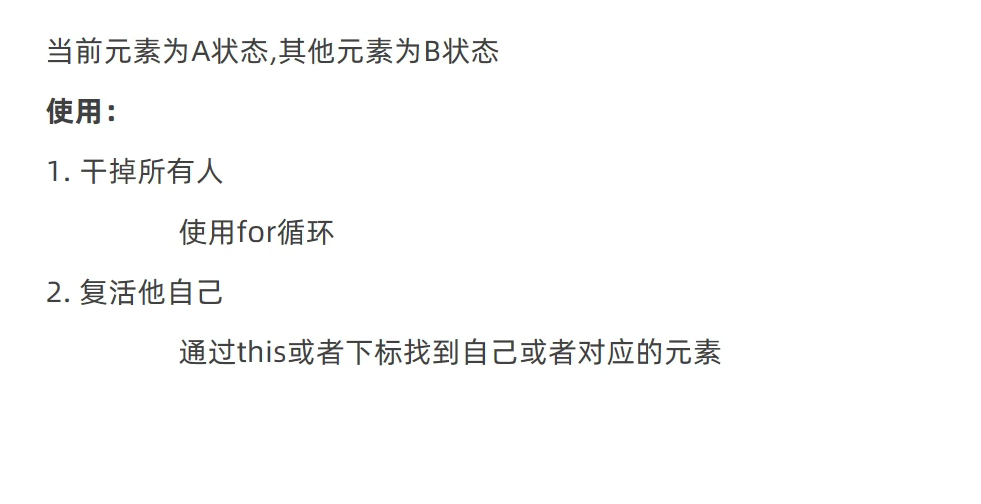

# 综合案例

# 附录：代码
## 1、随机点名（简单版）代码
```javascript

<body>
    <h2>随机点名（简单版）</h2>
    <div class="box">
        <span>名字是：</span>
        <div class="qs">这里显示姓名</div>
    </div>
    <div class="btns">
        <button class="start">开始</button>
        <button class="end">结束</button>
    </div>

    <script>
        // 数据数组
        let arr = ['马超', '黄忠', '赵云', '关羽', '张飞','刘备','曹操']
        function getRandom(min, max) {
            return Math.floor(Math.random() * (max - min + 1)) + min
        }
        let name = document.querySelector('.qs')
        let btn = document.querySelector('.start')

        btn.addEventListener('click',function(){
            let random = getRandom(0,arr.length - 1)
            // console.log(arr[random]);
            name.innerHTML = arr[random]
            arr.splice(random, 1)
            if(arr.length === 0){
                btn.disabled =true
                btn.innerHTML='点完了！'
            }
        })

        

    </script>
</body>

```

### 2、随机点名（开始和结束）代码
```javascript

    <script>
        // 数据数组
        let arr = ['马超', '黄忠', '赵云', '关羽', '张飞','刘备','曹操']
        function getRandom(min, max) {
            return Math.floor(Math.random() * (max - min + 1)) + min
        }
        // 1、获取元素   div和两个按钮
        let qs = document.querySelector('.qs')
        let start = document.querySelector('.start')
        let end = document.querySelector('.end')
        let i = 0
        // 全局变量
        let timer = 0
        let random = 0
        // 2、开始按钮
        start.addEventListener('click',function(){
        // 3、开始随机点名，计时器    
            timer = setInterval(function(){
                random = getRandom(0, arr.length-1)
                qs.innerHTML = arr[random]
            },25)
            // 如果到了最后一个就禁用两个按钮
            if(arr.length === 1){
                start.disabled =true
                end.disabled = true
            }
        })
        // 4、结束按钮
        end.addEventListener('click',function(){
            // 停止计时器
            clearInterval(timer)
            // 删除已抽到的数组元素
            arr.splice(random,1)
        })
    </script>

```