[TOC]
# 事件对象
## 获取事件对象
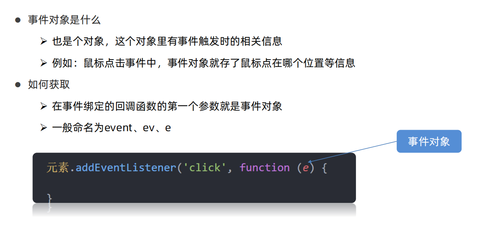
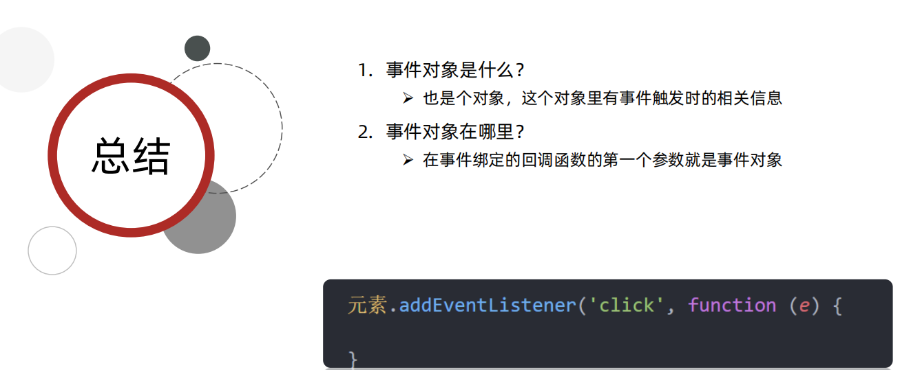
## 事件对象常用属性
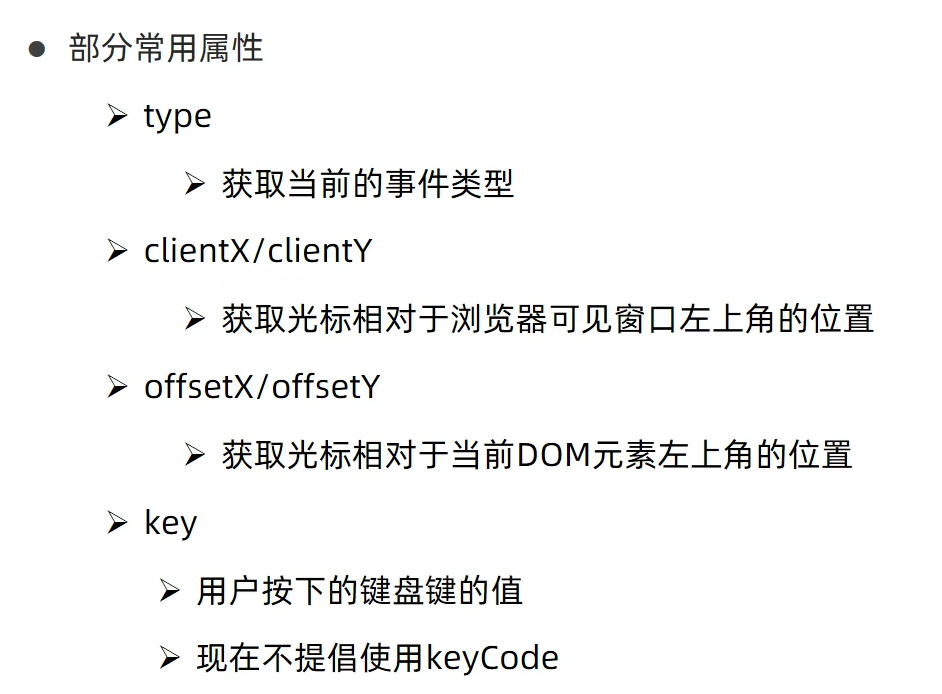
# 事件流
## 事件流与两个阶段说明
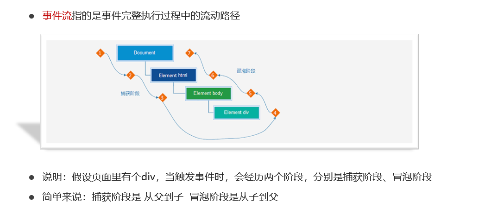
## 事件捕获和事件冒泡
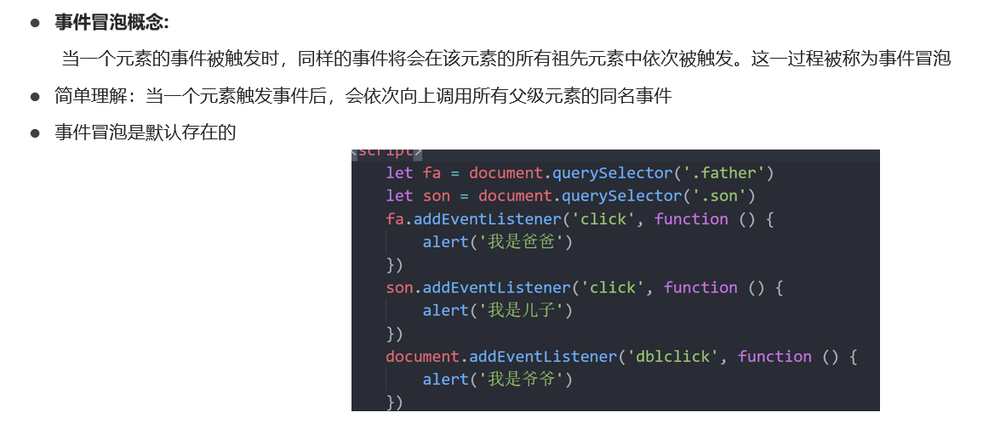
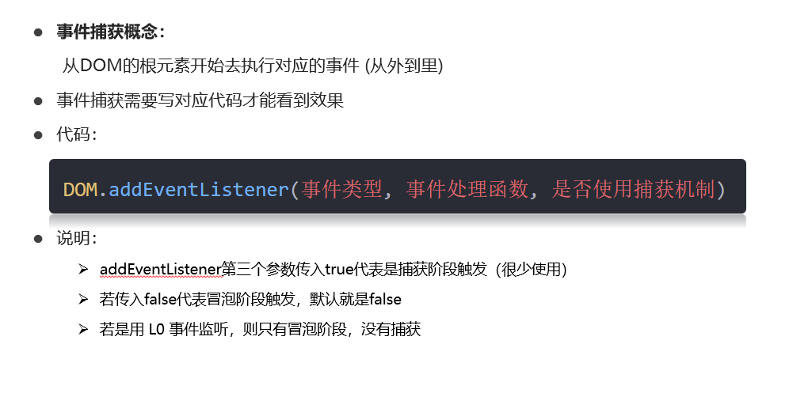
## 阻止事件流动
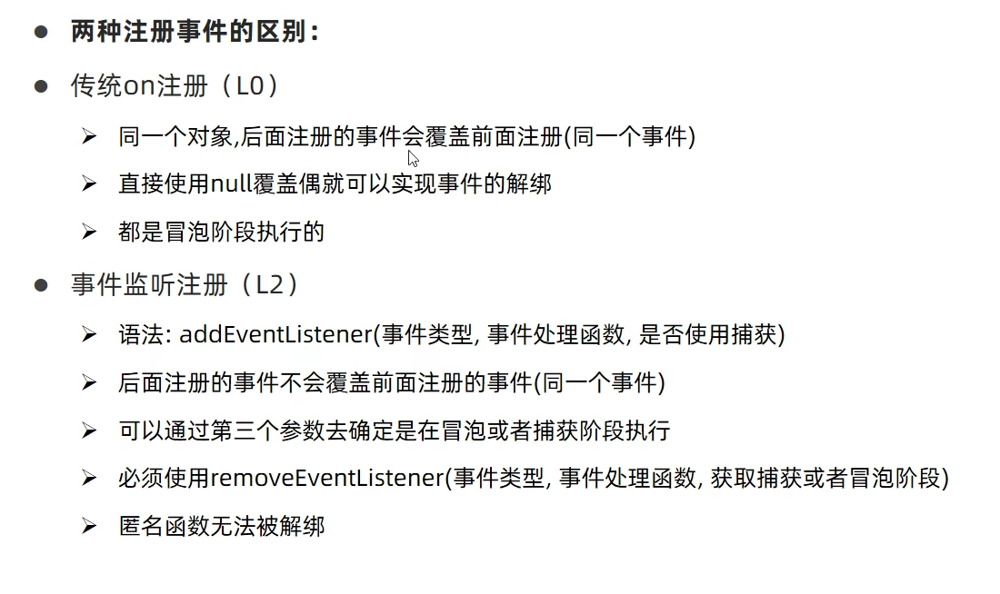
- 1. l0 on
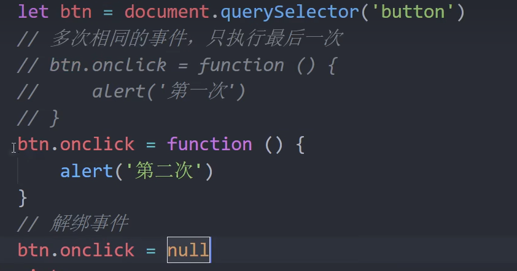
- 2. addEventListener
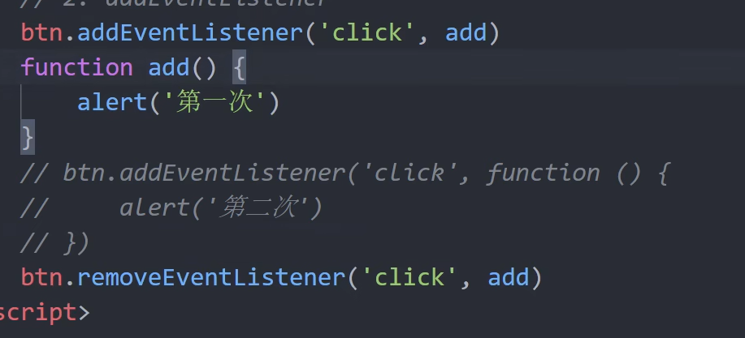
# 事件委托
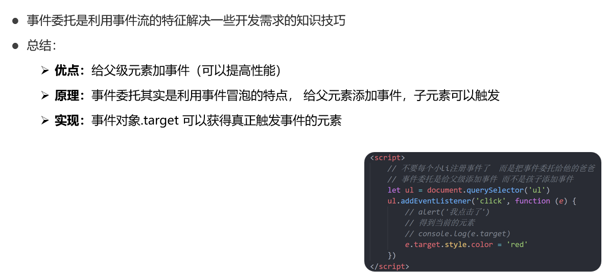
# 综合案例
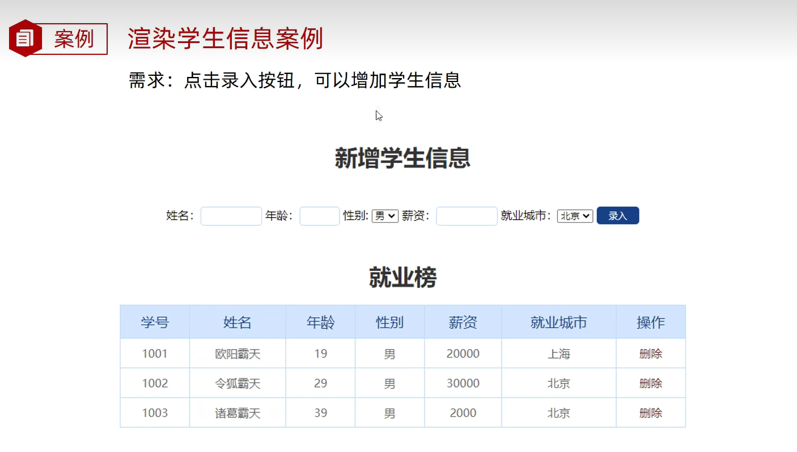
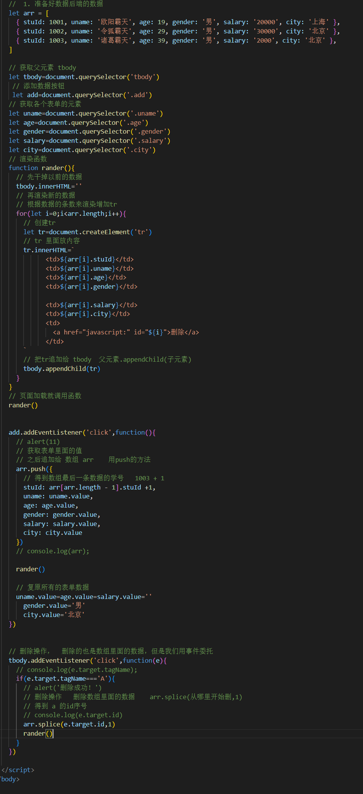

# 附录：代码
## 综合案例
```javascript
    //  1. 准备好数据后端的数据
    let arr = [
      { stuId: 1001, uname: '欧阳霸天', age: 19, gender: '男', salary: '20000', city: '上海' },
      { stuId: 1002, uname: '令狐霸天', age: 29, gender: '男', salary: '30000', city: '北京' },
      { stuId: 1003, uname: '诸葛霸天', age: 39, gender: '男', salary: '2000', city: '北京' },
    ]

    // 获取父元素 tbody
    let tbody=document.querySelector('tbody')
     // 添加数据按钮
     let add=document.querySelector('.add')
    // 获取各个表单的元素
    let uname=document.querySelector('.uname')
    let age=document.querySelector('.age')
    let gender=document.querySelector('.gender')
    let salary=document.querySelector('.salary')
    let city=document.querySelector('.city')
    // 渲染函数
    function rander(){
      // 先干掉以前的数据
      tbody.innerHTML=''
      // 再渲染新的数据
      // 根据数据的条数来渲染增加tr
      for(let i=0;i<arr.length;i++){
        // 创建tr
        let tr=document.createElement('tr')
        // tr 里面放内容
        tr.innerHTML=`
              <td>${arr[i].stuId}</td>
              <td>${arr[i].uname}</td>
              <td>${arr[i].age}</td>
              <td>${arr[i].gender}</td>

              <td>${arr[i].salary}</td>
              <td>${arr[i].city}</td>
              <td>
                <a href="javascript:" id="${i}">删除</a>
              </td>
        `
        // 把tr追加给 tbody  父元素.appendChild(子元素)
        tbody.appendChild(tr)
      }
    }
    // 页面加载就调用函数
    rander()

 
    add.addEventListener('click',function(){
      // alert(11)
      // 获取表单里面的值
      // 之后追加给 数组 arr    用push的方法
      arr.push({
        // 得到数组最后一条数据的学号   1003 + 1
        stuId: arr[arr.length - 1].stuId +1,
        uname: uname.value, 
        age: age.value, 
        gender: gender.value,
        salary: salary.value,
        city: city.value
      })
      // console.log(arr);
      
      rander()

      // 复原所有的表单数据
      uname.value=age.value=salary.value=''
        gender.value='男'
        city.value='北京'
    })
    

    // 删除操作，  删除的也是数组里面的数据，但是我们用事件委托
    tbody.addEventListener('click',function(e){
      // console.log(e.target.tagName);
      if(e.target.tagName==='A'){
        // alert('删除成功！')
        // 删除操作   删除数组里面的数据    arr.splice(从哪里开始删,1)
        // 得到 a 的id序号
        // console.log(e.target.id)
        arr.splice(e.target.id,1)
        rander()
      }
    })

```